<div align="center">



<br/><br/>

[](https://leetcode.com/u/Yuvika687/)
[](https://github.com/Yuvika687/LeetCode_solutions)
[](https://github.com/Yuvika687/LeetCode_solutions)
[](./scripts/new_problem.py)

</div>

<br/>

## 📌 Engineering Philosophy & Methodology

This repository is maintained as a rigorous catalog of algorithmic patterns, data structure implementations, and mathematical proofs. Rather than memorizing one-off tricks, each solution is organized around invariant properties and asymptotic bounds:

* **Invariant-Based Thinking**: Identifying preconditions, loop invariants, and postconditions before writing code.
* **Asymptotic Proofs**: Every problem documents concrete $\mathcal{O}(\cdot)$ Time and Auxiliary Space complexity bounds.
* **Idiomatic Implementations**: Production-grade C++ (STL memory management, move semantics) and clean Python (type annotations, generator comprehensions).

---

## ▶️ Execution Trace: Pointer Convergence Example

<div align="center">
  
</div>

<br/>

> **Trace Insight ([#881 Boats to Save People](./Two-Pointers/0881-Boats-to-Save-People/))**: Demonstrates greedy two-pointer convergence. By sorting the array in $\mathcal{O}(N \log N)$, we establish a monotonic relationship that guarantees pairing the heaviest candidate with the lightest candidate yields the optimal minimum partition.

---

## 🗂️ Algorithmic Pattern Matrix

| Domain | Solutions | Key Algorithmic Invariants | Status |
| :--- | :---: | :--- | :---: |
| 🗃️ **[Arrays & Hashing](./Arrays-and-Hashing/)** | 1 | Complement indexing via Hash Table lookup in $\mathcal{O}(1)$ avg | 🟢 Active |
| 🔗 **[Linked List](./Linked-List/)** | 1 | Sentinel dummy heads, carry accumulation, in-place pointer rewiring | 🟢 Active |
| 🎯 **[Binary Search](./Binary-Search/)** | 1 | Monotonic answer space reduction, integer ceiling arithmetic | 🟢 Active |
| 👥 **[Two Pointers](./Two-Pointers/)** | 1 | Greedy boundary convergence, pair-sum minimization | 🟢 Active |
| 🪟 **Sliding Window** | 0 | Dynamic vs fixed interval expansion & contraction | ⚪ In Progress |
| 📚 **Stack** | 0 | Monotonic next-greater-element evaluation | ⚪ In Progress |
| 🌲 **Trees & Graphs** | 0 | DFS recursion stack bounds, BFS shortest-path queues | ⚪ In Progress |
| 🧩 **Dynamic Programming** | 0 | State transitions, DAG memoization, space compression | ⚪ In Progress |

---

## 📑 Master Problem Log

| Problem # | Title | Category | Difficulty | Language | Time | Space | Solution | Solved |
| :-: | :--- | :--- | :-: | :-: | :-: | :-: | :-: | :-: |
| 0001 | [Two Sum](https://leetcode.com/problems/two-sum/) | Arrays & Hashing | `Easy` | C++ | $\mathcal{O}(N)$ | $\mathcal{O}(N)$ | [Code](./Arrays-and-Hashing/0001-Two-Sum/) | 2026-09-21 |
| 0002 | [Add Two Numbers](https://leetcode.com/problems/add-two-numbers/) | Linked List | `Medium` | C++ | $\mathcal{O}(\max(M, N))$ | $\mathcal{O}(1)$ aux | [Code](./Linked-List/0002-Add-Two-Numbers/) | 2026-09-21 |
| 0875 | [Koko Eating Bananas](https://leetcode.com/problems/koko-eating-bananas/) | Binary Search | `Medium` | Python | $\mathcal{O}(N \log M)$ | $\mathcal{O}(1)$ | [Code](./Binary-Search/0875-Koko-Eating-Bananas/) | 2026-09-21 |
| 0881 | [Boats to Save People](https://leetcode.com/problems/boats-to-save-people/) | Two Pointers | `Medium` | Python | $\mathcal{O}(N \log N)$ | $\mathcal{O}(1)$ aux | [Code](./Two-Pointers/0881-Boats-to-Save-People/) | 2026-09-22 |

---

## ⚡ Scaffolding Automation CLI

A lightweight internal tool is provided in `scripts/new_problem.py` to automatically scaffold folders, boilerplate solutions, and documentation templates:

```bash
# Interactive mode
python3 scripts/new_problem.py

# One-line flag mode
python3 scripts/new_problem.py \
  --number 121 \
  --title "Best Time to Buy and Sell Stock" \
  --topic "Sliding-Window" \
  --difficulty "Easy" \
  --lang "py"
```

---

<div align="center">
  <sub>Maintained by <strong><a href="https://github.com/Yuvika687">Yuvika Malhotra</a></strong> · Engineering Discipline</sub>
</div>