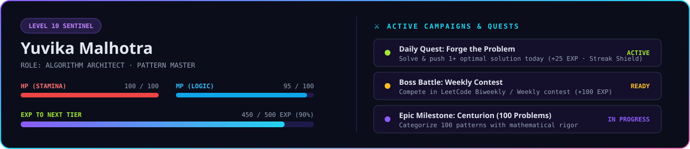

<div align="center">


<br/><br/>

<!-- LeetCode Official Profile & Solved Badges -->
<a href="https://leetcode.com/u/Yuvika687/">
  
</a>
<a href="https://leetcode.com/u/Yuvika687/">
  
</a>


<br/>

<!-- Streak & Telemetry Badges -->


<br/><br/>

### ▶️ Algorithm Replay — Step-by-Step Execution


> ⚡ **Dynamic Execution Trace:** Real-time state visualization of algorithmic pointer convergence, space allocation, and computational complexity proofs.

<br/>

### 🎮 Player Profile & RPG Stats



<br/>

**Quick Navigation:**
<a href="#topic-matrix"></a>
&nbsp;
<a href="#master-log"></a>
&nbsp;
<a href="#achievements"></a>
&nbsp;
<a href="#scaffold-cli"></a>

</div>

<br/>

---

<a id="achievements"></a>

## 🏆 Achievements & Badges

| Badge | Title | Requirement | Status |
|:---:|:---|:---|:---:|
| 🛡️ | **Centurion** | Solve 100+ LeetCode problems | 🟡 In Progress (4/100 · 4%) |
| 🔥 | **Habit Locked** | Maintain a 30-Day continuous streak | 🟡 Active Streak Engaged |
| ⚡ | **Pyromancer** | Maintain a 50-Day continuous streak | 🔒 Locked |
| 🌟 | **Century Flame** | Maintain a 100-Day continuous streak | 🔒 Locked |
| 👥 | **Two Pointer Tactician** | Master convergent & sliding window pointers | **UNLOCKED** ✅ (Boats to Save People) |
| 🎯 | **Binary Search Sniper** | Master monotonic answer space search | **UNLOCKED** ✅ (Koko Eating Bananas) |
| 🔗 | **Linked List Alchemist** | Master pointer manipulation & carry logic | **UNLOCKED** ✅ (Add Two Numbers) |
| 🗃️ | **Hash Map Maverick** | Master constant-time frequency lookups | **UNLOCKED** ✅ (Two Sum) |

<br/>

### ⚔️ The Daily Creed
> *"We do not rise to the level of our goals, we fall to the level of our daily systems."*  
> **Deliberate daily practice.** One problem solved, one pattern mastered, clean commits shipped.

### 🎯 Active Quests & Milestones
* 🗡️ **Daily Quest — Forge the Strike**: Solve at least 1 problem and push clean code today. *(Reward: +25 EXP · Streak Shield)*
* 👹 **Weekly Boss — Contest Arena**: Compete in the official LeetCode Weekly / Biweekly Contest. *(Reward: +100 EXP · Rating Surge)*
* 🏆 **Epic Milestone — Centurion**: Reach 100 categorized pattern solutions. *(Reward: +250 EXP · Title: Algorithm Warlord)*

<br/>

---

<a id="topic-matrix"></a>

## 🗂️ Topic Matrix

| Topic | Solved | Key Patterns | Status |
| :--- | :---: | :--- | :---: |
| 🗃️ [Arrays & Hashing](./Arrays-and-Hashing/) | 1 | Hash Map Complement Lookup, Prefix Sum | 🟢 Active |
| 🔗 [Linked List](./Linked-List/) | 1 | Dummy Head, Pointer Traversal, Carry Arithmetic | 🟢 Active |
| 🎯 [Binary Search](./Binary-Search/) | 1 | Search on Monotonic Answer Range $\mathcal{O}(\log N)$ | 🟢 Active |
| 👥 [Two Pointers](./Two-Pointers/) | 1 | Greedy Boundary Convergence, Sort Pairing | 🟢 Active |
| 🪟 Sliding Window | 0 | Fixed & Dynamic Window Sizing | ⚪ Planned |
| 📚 Stack | 0 | Monotonic Stack, Parentheses Matching | ⚪ Planned |
| 🌲 Trees & Tries | 0 | DFS, BFS, Prefix Tree Retrieval | ⚪ Planned |
| 🏔️ Heap / Priority Queue | 0 | Top-K Elements, Median Finder | ⚪ Planned |
| 🌐 Graphs & BFS/DFS | 0 | Topological Sort, Dijkstra, Union-Find | ⚪ Planned |
| 🧩 Dynamic Programming | 0 | Memoization, Tabulation, Knapsack Patterns | ⚪ Planned |

<br/>

---

<a id="master-log"></a>

## 📑 Master Problem Log

| # | Problem | Difficulty | Category | Language | Complexity | Solution | Date Solved |
| :-: | :--- | :-: | :--- | :-: | :-: | :-: | :-: |
| 0001 | [Two Sum](https://leetcode.com/problems/two-sum/) | `Easy` | Arrays & Hashing | C++ | $\mathcal{O}(N)$ Time · $\mathcal{O}(N)$ Space | [Code](./Arrays-and-Hashing/0001-Two-Sum/) | 2026-09-21 |
| 0002 | [Add Two Numbers](https://leetcode.com/problems/add-two-numbers/) | `Medium` | Linked List | C++ | $\mathcal{O}(\max(M, N))$ Time · $\mathcal{O}(1)$ Aux | [Code](./Linked-List/0002-Add-Two-Numbers/) | 2026-09-21 |
| 0875 | [Koko Eating Bananas](https://leetcode.com/problems/koko-eating-bananas/) | `Medium` | Binary Search | Python | $\mathcal{O}(N \log M)$ Time · $\mathcal{O}(1)$ Space | [Code](./Binary-Search/0875-Koko-Eating-Bananas/) | 2026-09-21 |
| 0881 | [Boats to Save People](https://leetcode.com/problems/boats-to-save-people/) | `Medium` | Two Pointers | Python | $\mathcal{O}(N \log N)$ Time · $\mathcal{O}(1)$ Space | [Code](./Two-Pointers/0881-Boats-to-Save-People/) | 2026-09-22 |

<br/>

---

<a id="scaffold-cli"></a>

## ⚡ Scaffolder CLI Workflow

A custom automation engine is built in `scripts/new_problem.py` to scaffold new questions with zero friction.

### Interactive Mode:
```bash
python3 scripts/new_problem.py
```

### Fast-Flag One-Liner:
```bash
python3 scripts/new_problem.py \
  --number 121 \
  --title "Best Time to Buy and Sell Stock" \
  --topic "Sliding-Window" \
  --difficulty "Easy" \
  --lang "py"
```

---

## 🏷️ Commit Message Standard

* `feat(0001): solve Two Sum in C++ with hash map [O(n)]`
* `feat(0875): solve Koko Eating Bananas with binary search [O(n log m)]`
* `refactor(0002): optimize dummy head cleanup in Add Two Numbers`
* `docs: update master log table and badges`

---

<p align="center">
  Crafted with care by <strong><a href="https://github.com/Yuvika687">Yuvika Malhotra</a></strong> • Keep Grinding 🚀
</p>